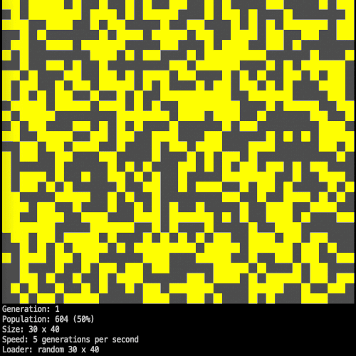

# Game of Life


[](https://github.com/kulapard/gol/blob/master/LICENSE)
[](https://github.com/kulapard/gol/actions/workflows/release.yml)
[](https://github.com/kulapard/gol/actions/workflows/release.yml)
[](https://codecov.io/github/kulapard/gol)
[](https://goreportcard.com/report/github.com/kulapard/gol)

[Conway's Game of Life](https://en.wikipedia.org/wiki/Conway%27s_Game_of_Life) written in Go



## Install ##

Using [Homebrew](https://brew.sh/) (OS X / Linux)

```shell
brew install kulapard/tap/gol
```

## Update ##

Using [Homebrew](https://brew.sh/) (OS X / Linux)

```shell
brew upgrade kulapard/tap/gol
```

## Usage ##

Run with default parameters (size 30 x 40, random initial state):

```shell
gol run
```

Run initial state from file:

```shell
gol run --file ./example/board.txt
```

To see all available options:

```shell
gol run --help
```